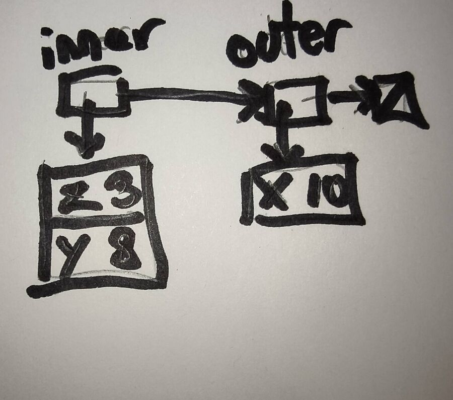
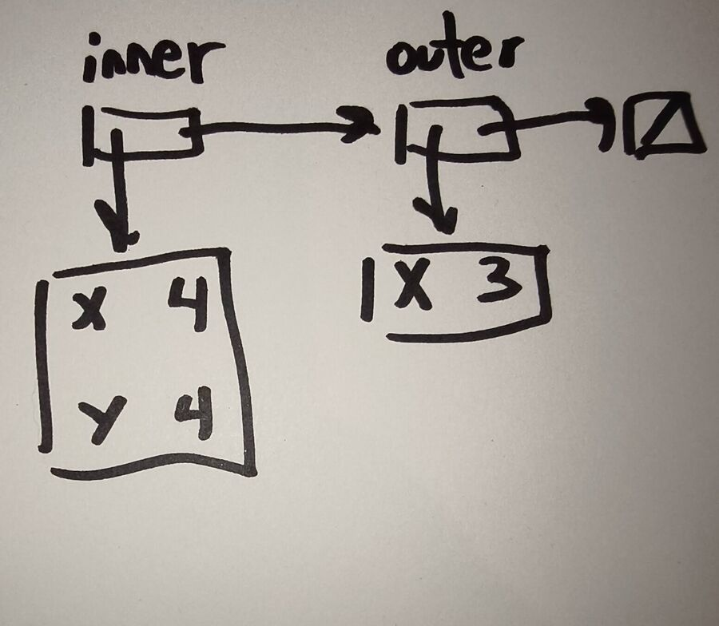
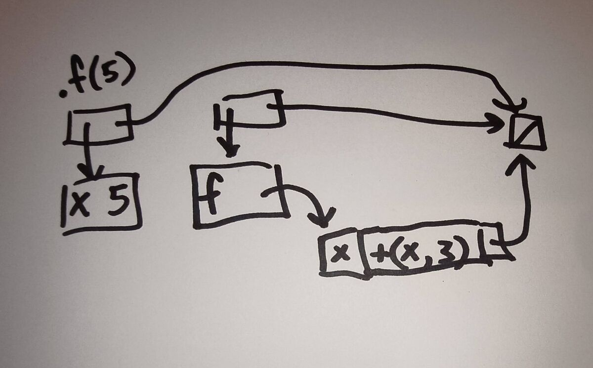
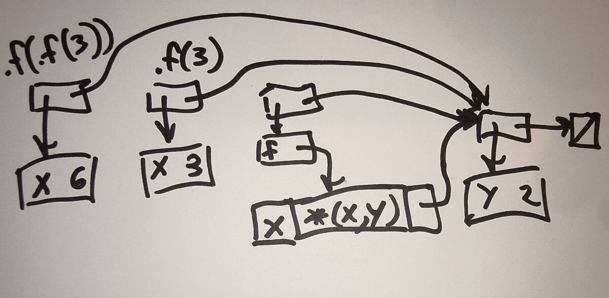

# How to Hand In a Drawing

Some questions ask you to **draw** an answer, such as an environment. Draw it
by hand on paper or on a tablet, photograph or export it, and put the image in
your assignment. No diagramming software is needed, and you do not have to
learn any.

## The rules

1. **One drawing per file.** Use `jpg`, `png`, or `pdf`. An iPhone may save
   photos as `.heic`; convert or export those to `.jpg` first.
2. **Name the file for the question part**, such as `q1a.jpg` or `q2b.png`, and
   save it in the assignment's directory, next to its `README.md`. The
   `drawings/` folder at the top of your repository holds the examples below
   and belongs to the course. Do not put your drawings there.
3. **In the `ANSWER` block, write the file name.** That is how I find your
   drawing. Anything else the question asks for goes in the block too.

   ````
   ```
   q1a.jpg
   Prediction: ... Ran it: ...
   ```
   ````

4. **Make it readable.** Use a dark pen, and crop the photo to the drawing.
   If I cannot read the drawing, I cannot give you credit for it.
5. **Run `save`.** It sends images along with everything else.

### Getting a photo into your codespace

Move the photo from your phone to your computer, however you normally do
that. Then drag the file from your computer onto the assignment's folder in
the VS Code **Explorer** pane. You can also right-click the folder and choose
**Upload...**. Check that the file shows up in the assignment's folder, such
as `src/a3/`, and rename it if it needs a new name.

## Drawing environments

These use the notation from class.

- **An environment node** is a small box with two arrows. The **down** arrow
  goes to its bindings, and the **right** arrow goes to its parent.
- **Bindings** are a table with one name and its value per row.
- **The end of the chain** is a box with a diagonal line through it.
- **A procedure value** (a `ProcVal`) is a box with three slots: its formals,
  its body, and an arrow to the environment it saved. A binding whose value is
  a `ProcVal` has an arrow to that box.
- **Label each node a procedure application creates** with that
  application, such as `.f(5)`. That node is where the procedure's body is
  evaluated. Other labels that help, such as *inner* and *outer*, are welcome.

**To draw an environment, draw the whole chain**, from that node to the end
box. A program starts in a node with no bindings (in `V1` and `V2`, it holds
the Roman numerals). That node is optional: draw it, or end the chain at the
end box directly, as the examples do.

## Examples

### A nested `let`

```
let x = 10 in
  let z = 3 y = 8 in
    +(x,y)
```

The environment `+(x,y)` is evaluated in. Looking up `x` misses in the inner
node and then hits in the outer one. The program prints `18`.



### Shadowing

```
let x = 3 in
  let x = add1(x) y = add1(x) in
    +(x,y)
```

The environment `+(x,y)` is evaluated in. `y` is `4`, not `5`, because both
right-hand sides are evaluated in the **outer** environment, where `x` is `3`.
The program prints `8`.



### Applying a procedure

```
let f = proc(x) +(x, 3) in
  .f(5)
```

For the application `.f(5)`, this shows the environment `f`'s body is
evaluated in (the node labeled `.f(5)`, which the application created), and
the environment `.f(5)` itself is evaluated in (the node that holds `f`),
with the value of `f`. The `ProcVal` saved the environment the `proc` was
evaluated in: the starting one, drawn here as just the end box. The
application's node `x = 5` extends **that** environment, not the node that
holds `f`. The program prints `8`.



### Applying it twice

```
let y = 2 in
  let f = proc(x) *(x, y) in
    .f(.f(3))
```

Every application makes a **new** node, and each one extends the environment
the `ProcVal` saved, which is the node holding `y`. `y` is found through that
parent. `.f(3)` runs first, because an application evaluates its operands
before it applies anything. The program prints `12`.


